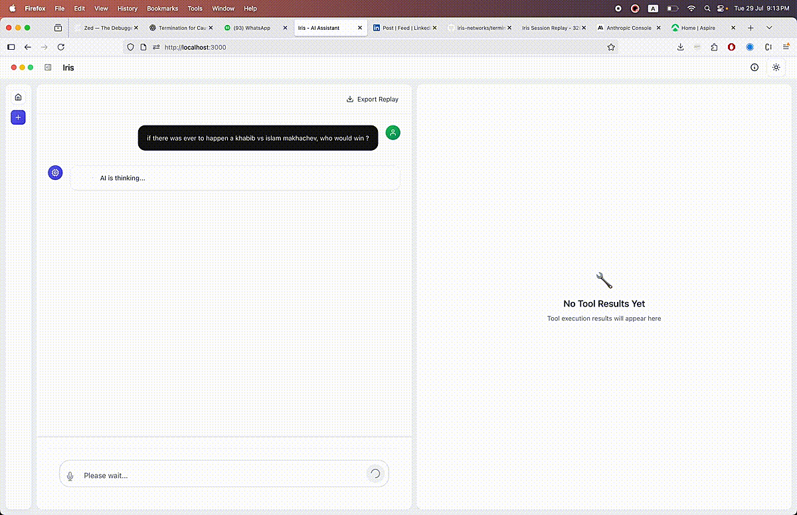

<div align="center">
  <a href="https://github.com/iris-networks/terminator">
    
  </a>
  <h1 align="center">Terminator</h1>
  <p align="center">
    The AI-powered research and automation platform.
  </p>
  <div align="center">
    <a href="https://github.com/iris-networks/terminator/blob/main/LICENSE">
      
    </a>
    <a href="https://github.com/iris-networks/terminator/issues">
      
    </a>
    <a href="https://github.com/iris-networks/terminator/pulls">
      
    </a>
    <a href="https://www.typescriptlang.org/">
      
    </a>
    <a href="https://nodejs.org/">
      
    </a>
    <a href="https://nextjs.org/">
      
    </a>
    <a href="https://react.dev/">
      
    </a>
    <a href="https://tailwindcss.com/">
      
    </a>
    <a href="https://expressjs.com/">
      
    </a>
    <a href="https://socket.io/">
      
    </a>
    <a href="https://pptr.dev/">
      
    </a>
    <a href="https://bun.sh/">
      
    </a>
    <a href="https://pnpm.io/">
      
    </a>
    <a href="https://vercel.com/">
      
    </a>
    <a href="https://openai.com/gpt-4">
      
    </a>
    <a href="https://deepmind.google/technologies/gemini/">
      
    </a>
    <a href="https://www.anthropic.com/claude">
      
    </a>
    <a href="https://discord.gg/uuNbJQyw6g">
      
    </a>
  </div>
</div>

## What is Terminator?

Terminator is a modern AI-powered research and automation platform with advanced web capabilities. It's designed to be a multi-agent AI platform for code execution, research, and browser automation with standalone binary deployment.



## Getting Started

The easiest way to get started with Terminator is by cloning the repository and running the watch command.

**1. Clone the repository:**

```bash
git clone https://github.com/iris-networks/terminator.git
cd terminator
```

**2. Install dependencies:**

```bash
bun install
```

**3. Set up your environment:**

Copy the example environment file and configure your AI provider:
```bash
cp .env.example .env
```

Edit the `.env` file with your API key:
```bash
AI_MODEL=claude-sonnet-4-20250514
AI_PROVIDER=anthropic
ANTHROPIC_API_KEY=your_anthropic_api_key_here
```

### Supported AI Providers

Terminator supports multiple AI providers including Anthropic, OpenAI, Google Gemini, Ollama, and OpenRouter. 

For detailed setup instructions for each provider, see the [AI Providers Documentation](./docs/AI_PROVIDERS.md).


**3. Install dependencies and run the app:**

**4. Start the application:**

```bash
bun dev:watch
```

Once running, you can access the Terminator platform at [http://localhost:3000](http://localhost:3000).

## Features

- **Code Execution**: Sandboxed Node.js, Python, and Shell environments with real-time output streaming and automatic dependency management.
- **Research**: Structured multi-step research workflows with web search, source attribution, and comprehensive report generation.
- **Browser Automation**: Full page automation with Puppeteer, session recording and replay, and visual element interaction.
- **Multi-Agent System**: A multi-agent system with specialized capabilities and persistent session management.
- **Extensible Tool Registry**: An extensible tool registry to add new capabilities to the platform.

## Documentation

For more detailed information on how to use and configure Terminator, please refer to the [documentation](./docs/README.md).

## Community

Join our community on [Discord](https://discord.gg/uuNbJQyw6g) to ask questions, share your projects, and connect with other developers.

## Contributing

We welcome contributions from the community! Please read our [contributing guidelines](./CONTRIBUTING.md) to get started.

## License

Terminator is licensed under the [Apache License 2.0](./LICENSE).
